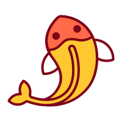

 

# Koifish


I am a Fish, name is Koifish.

# Code of Conduct
  
[Contributor Covenant Code of Conduct](docs/src/contributing/CODE_OF_CONDUCT.md) 

# CLA

[Contributor License Agreement](docs/src/contributing/cla.md)

# Code contribution

1. Install rust 

2. Install cargo

3. `git clone git@github.com:trisasnava/koifish.git` 

4. Write your code under `src|test`

```tree
    ├─src
    │  ├─handler
    │  ├─model
    │  └─widgets
    └─test
```

5. Read [contributor covenant code of conduct](CODE_OF_CONDUCT.md) and [sign the CLA](https://cla-assistant.io/trisasnava/koifish)

6. Submit a pull request(PR) 

# Document contribution

1.  Install mdbook `cargo install mdbook` 

2. `git clone git@github.com:trisasnava/koifish.git` 
 
3.  Write Markdown docs under the `docs/src`

```tree
    ├─docs
    │  ├─src
    │  │  ├─commands
    │  │  ├─contributing
    │  │  ├─getting-started
    │  │  ├─guide
    │  │  ├─reference
    │  │  └─roadmap
    │  └─theme
```

4. Read [contributor covenant code of conduct](CODE_OF_CONDUCT.md) and [sign the CLA](https://cla-assistant.io/trisasnava/koifish)

5. Run `mdbook serve` and open your browser [`http://localhost:3000`](http://localhost:3000) 

6. Submit a pull request(PR)

# FAQ

[FAQ](docs/src/faq.md)

# LICENSE

[Apache2.0](LICENSE)